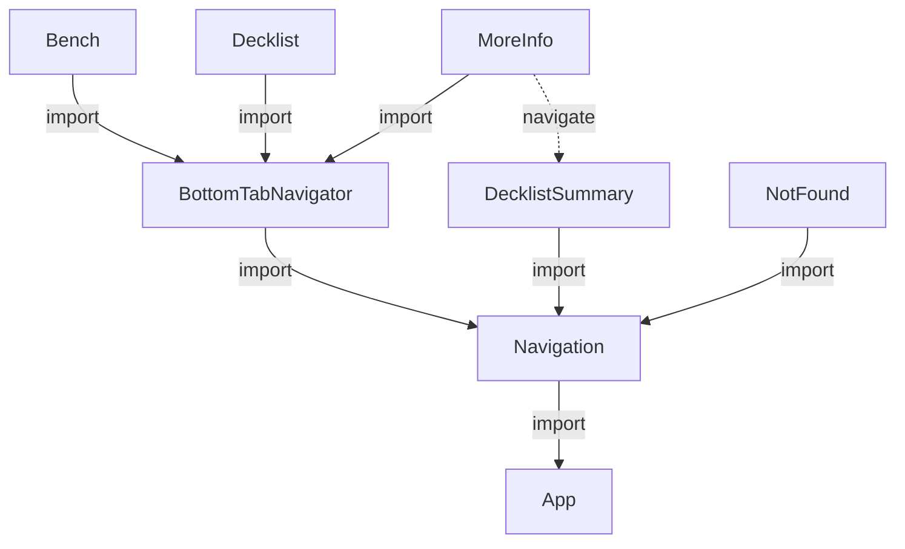

# Gathering

## Purpose

This is a reference implementation for a cross platform application using Expo, React Native, [MMKV](https://github.com/mrousavy/react-native-mmkv), and Storybook. It follows the [component-driven development](https://www.componentdriven.org/) philosophy.

## Quickstart

The Expo project was initialized with `npx expo init .`. Storybook was added with the step [described in the React Native tutorial](https://storybook.js.org/tutorials/intro-to-storybook/react-native/en/get-started/). It was necessary to modify the `addons.js` file to get things working.

The app can be started on the Expo server with `expo start`, which will publish an iOS and Web version on MacOS.

To run just the mobile version you can `yarn ios`. You can access this from a phone that has Expo Go installed.

## Component topology

The dependency graph of the navigation ans screen components is provided below for reference:

## Further reading

 - [Available icons catalog](https://icons.expo.fyi/)
 - [React Navigation docs](https://reactnavigation.org/)
